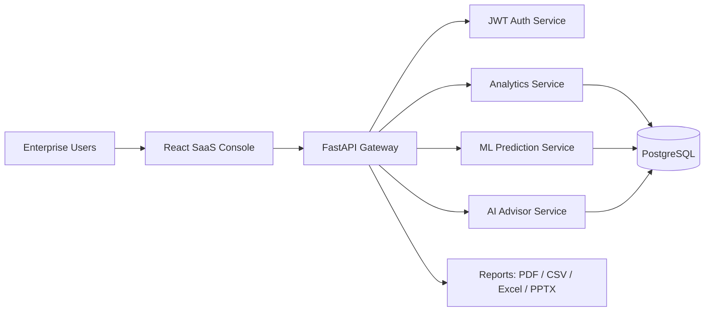
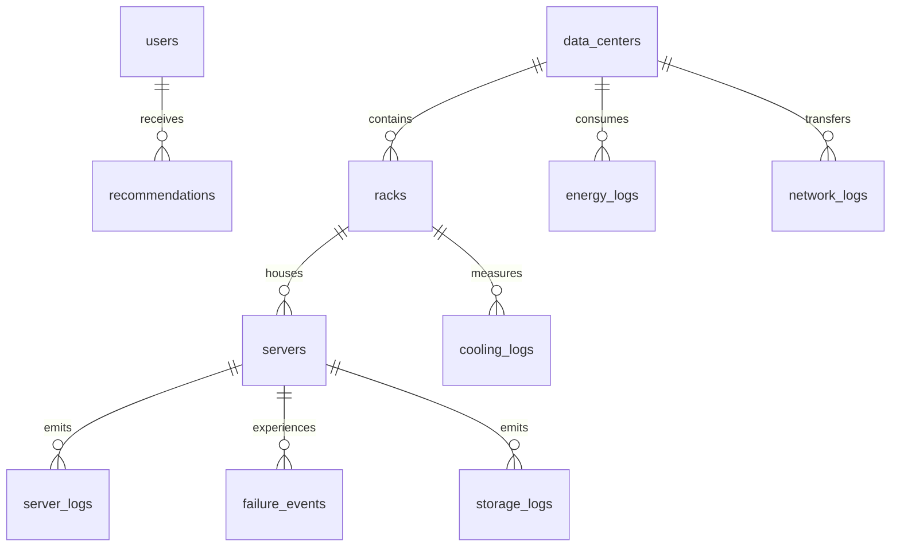

# NeuroDC - AI-Powered Autonomous Data Center Optimization Platform

NeuroDC is a production-oriented full-stack analytics platform for optimizing data center energy, cooling, cost, reliability, sustainability, and cloud infrastructure.

It includes a dark enterprise SaaS frontend, FastAPI backend, PostgreSQL schema, JWT authentication, ML-backed prediction services, synthetic data generation, and Docker deployment.

## Stack

- Frontend: React, TypeScript, TailwindCSS, ShadCN-style components, Framer Motion, Recharts, React Router
- Backend: Python, FastAPI, SQLAlchemy, JWT
- Database: PostgreSQL
- Analytics: Pandas, NumPy, Scikit-learn
- Deployment: Docker, Docker Compose

## Quick Start

```bash
docker compose up --build
```

Then open:

- Frontend: http://localhost:5173
- API: http://localhost:8000/docs

Default demo login:

- Email: `admin@neurodc.ai`
- Password: `NeuroDC2026!`

## Local Development

Backend:

```bash
cd backend
python -m venv .venv
.venv\Scripts\activate
pip install -r requirements.txt
uvicorn app.main:app --reload
```

Frontend:

```bash
cd frontend
npm install
npm run dev
```

## Data

On startup the API can create synthetic operational telemetry. The generator supports 100,000+ records across:

- Server logs
- Energy logs
- Network logs
- Storage logs
- Cooling logs
- Failure events
- Temperature and power usage
- Latency and bandwidth

Generate a CSV export:

```bash
cd backend
python scripts/generate_data.py --records 100000 --output ../data/neurodc_synthetic_100k.csv
```

## Architecture Diagram



## ER Diagram



## API Highlights

- `POST /api/auth/login`
- `POST /api/auth/register`
- `GET /api/dashboard/summary`
- `GET /api/infrastructure/analytics`
- `GET /api/energy/analytics`
- `GET /api/cooling/analytics`
- `GET /api/carbon/analytics`
- `GET /api/predictions/failures`
- `GET /api/optimization/cloud`
- `POST /api/sandbox/simulate`
- `GET /api/digital-twin`
- `POST /api/chat`
- `GET /api/reports/export/{format}`

Full OpenAPI docs are available at `/docs`.

## Screenshots

Run the app and capture:

- Landing page
- Executive dashboard
- Digital twin
- Optimization sandbox
- AI recommendations

## Product Notes

NeuroDC is designed for enterprise operations teams, sustainability leaders, FinOps analysts, and executives. It emphasizes actionable analytics: savings, risk reduction, carbon impact, failure prevention, and autonomous optimization recommendations.
